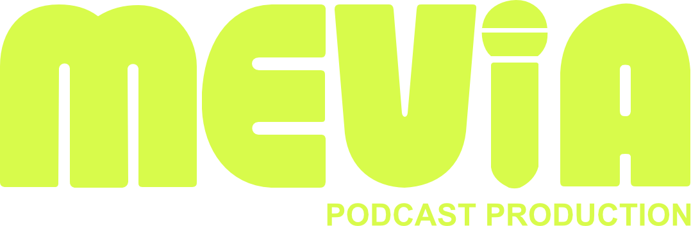

<h1 align="center">
   MEVIA Podcast Production Website
</h1>
<p align="center">
   Official website for <span style="font-weight: bold;">MEVIA Podcast Production GmbH</span> — built with React.js.
</p>
<p align="center" style="background-color: #1b1b17; padding: 10px;">
   
</p>
## 🛠 set-up

1. Install the dependencies

   ```sh
   npm install
   ```

2. Start the development server

   ```sh
   npm start
   ```

## 🚀 build and run for production

1. Generate a full static production build

   ```sh
   npm run build
   ```

## 🎨 color codes

| Color  | Hex                                                             |
| ------ | --------------------------------------------------------------- |
| Yellow |  `#d8fb4b` |
| Blue   |  `#443dff` |
| White  |  `#faf7f5` |
| Black  |  `#1b1b17` |
